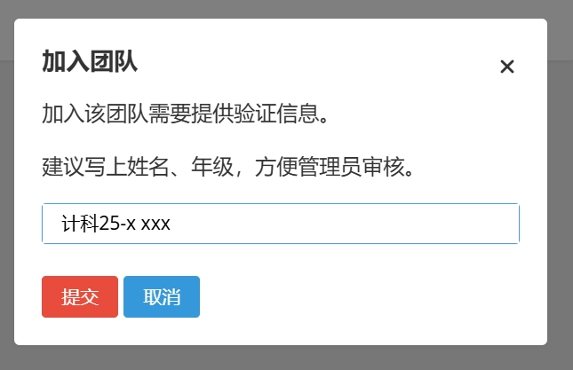

# 新生入门指南

## 如何安装与配置IDE

参考 [C/C++环境配置](../环境配置/C和C++环境配置.md)

## 如何注册洛谷

浏览器打开 [洛谷官网](https://www.luogu.com.cn/)，点击右上角的“注册”按钮

按要求填写相关信息，可选手机号/邮箱注册，注意用户名不能出现中文，只支持字母、数字、下划线 ~~中文用户名需要氪金~~

需要邮箱/手机收一个验证码，然后完成注册

来到登录页面，输入刚才注册的用户名，点击“下一步”

输入密码与验证码，点击“登录”

**验证码若看不清楚，可以点击验证码图片刷新**

登录完成后来到首页，至此，注册完成。

开始使用之前，一定要阅读 [洛谷新用户必读](https://www.luogu.com.cn/discuss/241461)

后续有关洛谷使用的问题可以阅读 [洛谷主站操作指南](https://help.luogu.com.cn/manual/luogu/) 或在群里提问

## 如何加入团队

打开 [BIGC竞赛训练队](https://www.luogu.com.cn/team/50877)

点击 `加入团队` 按钮

填写自己的姓名与所在班级，如图所示

然后点击提交，等待通过即可

## Markdown 基础语法教程

Markdown 的目标是实现「易读易写」，成为一种适用于网络的书写语言。

语法可参考 [洛谷 Markdown 格式手册](https://help.luogu.com.cn/rules/academic/handbook/markdown)