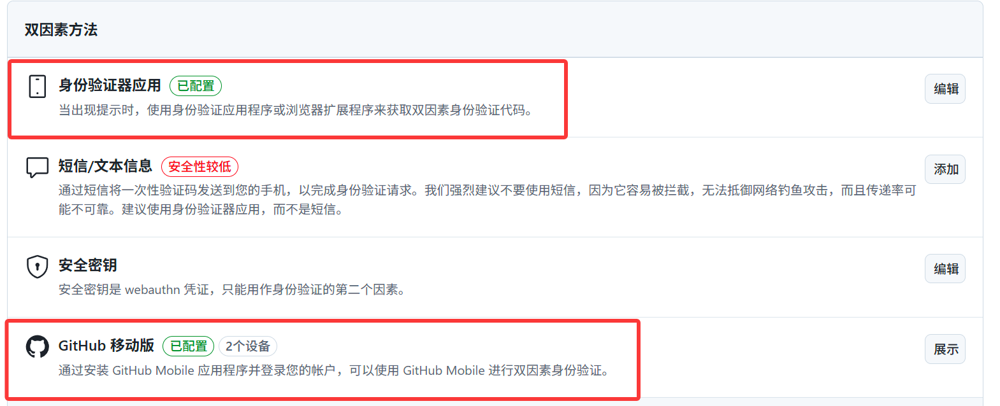
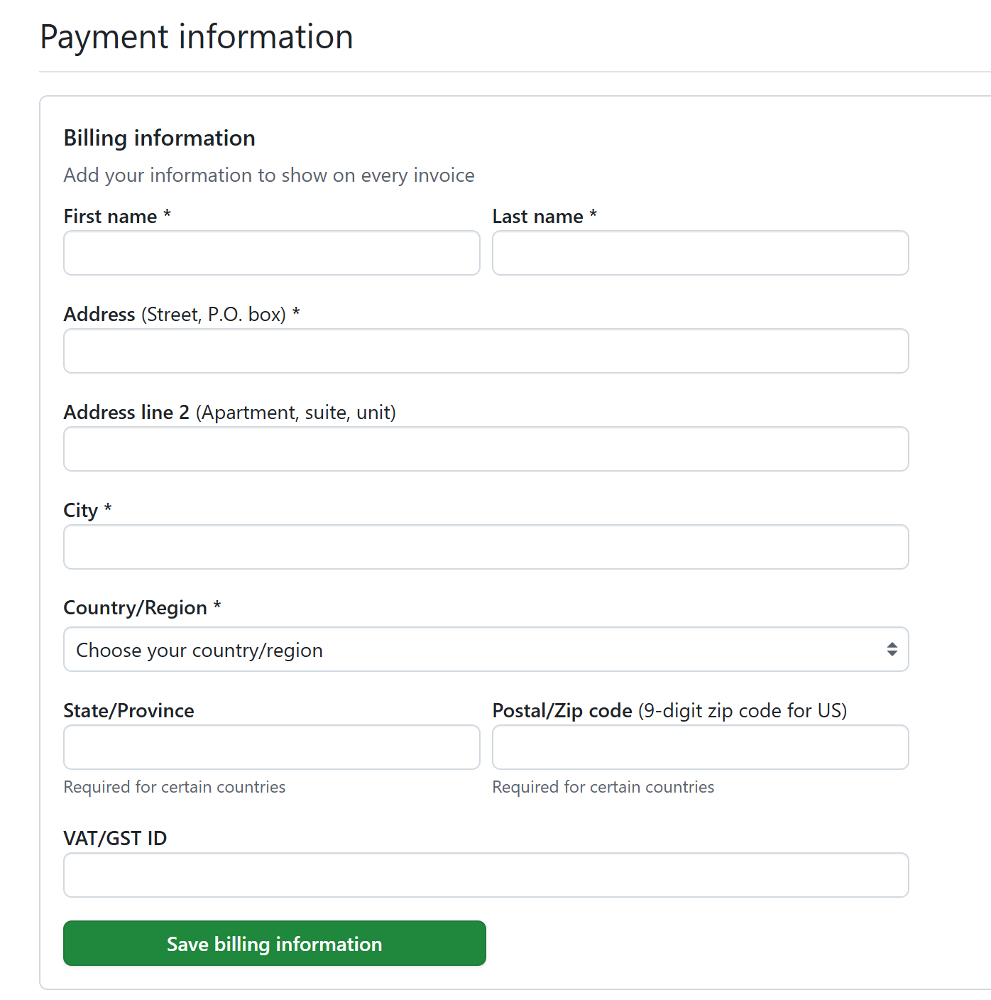
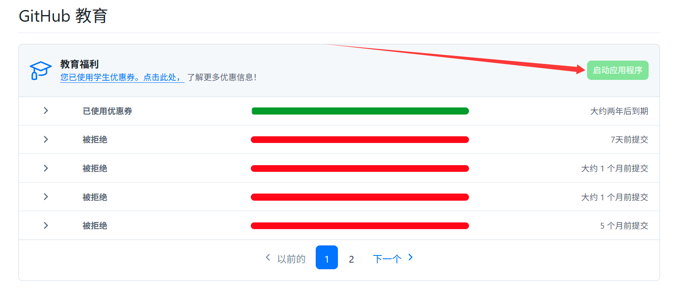
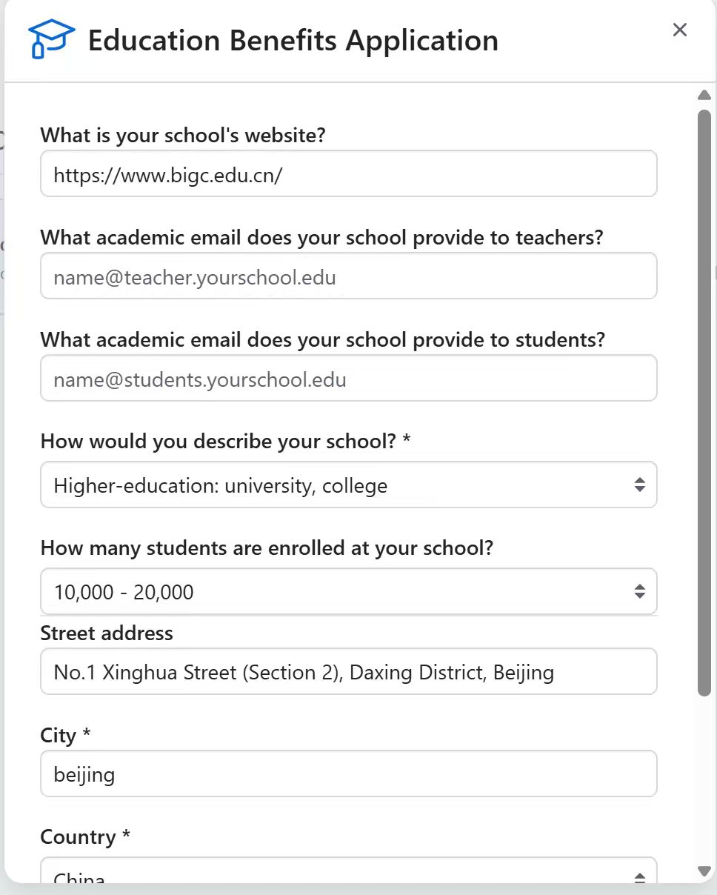
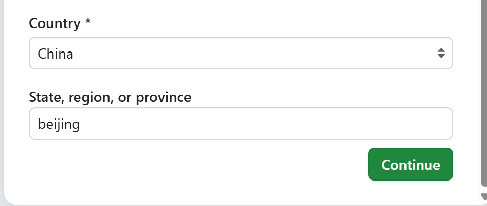
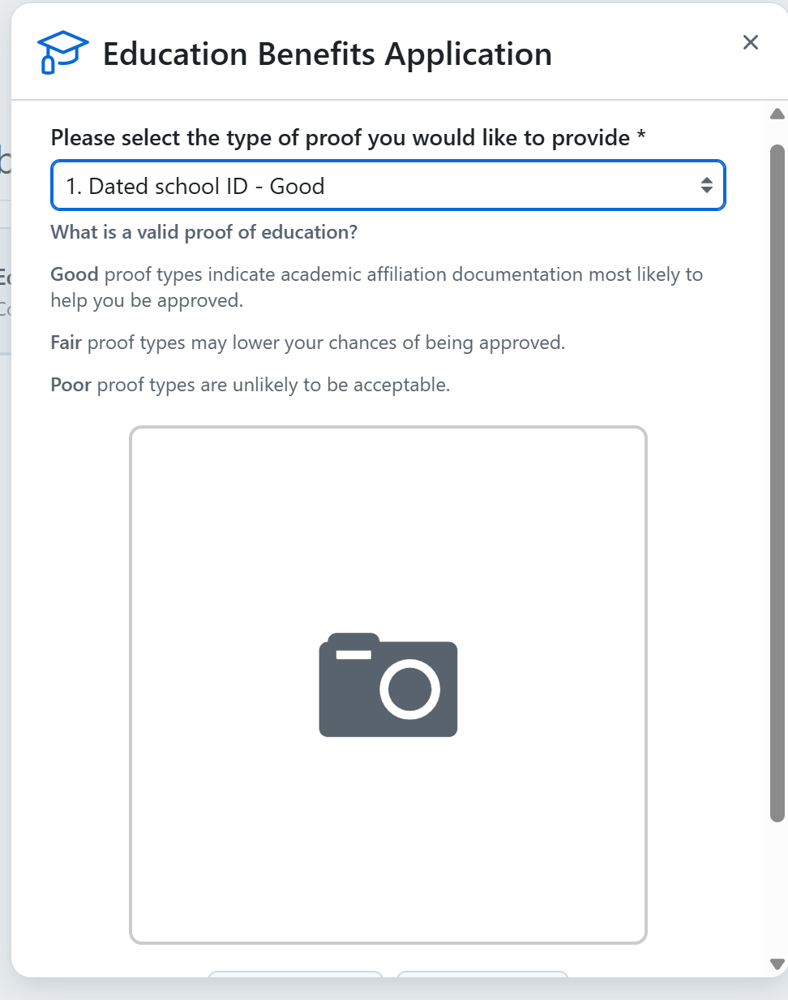

# Github申请教育优惠

## 前提准备

### Github账号

### Github启用双因素验证

身份验证器应用，Github移动版开一个即可，身份验证器在下文中，Github移动版也可以在Google Play商店下载

### Watt Toolkit

### Google Play商店和Authenticator(在Google Play中下载)或者身份验证器(浏览器插件)

### Google服务框架，GooglePlay服务，Google Play商店下载，可以看这个仓库

### 

### Github付款信息

### **付款信息中的姓氏和名字使用英文**

## 申请教育优惠

### 关闭所有VPN,连接校园网，打开Watt Toolkit进行加速

### 选中以下服务进行加速

按照如下图片填写即可，可以直接复制下列信息

1. **https://www.bigc.edu.cn/**
2. **No.1 Xinghua Street (Section 2), Daxing District, Beijing**

### 上传学信网验证报告截图

**选择第一项，再将学信网验证报告的截图上传，上传后提交即可**

