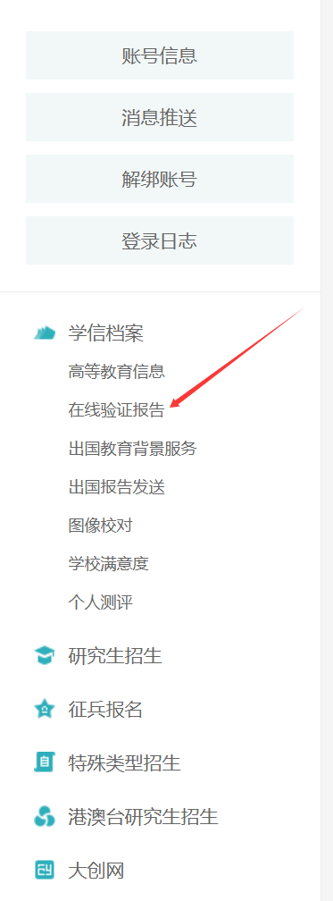
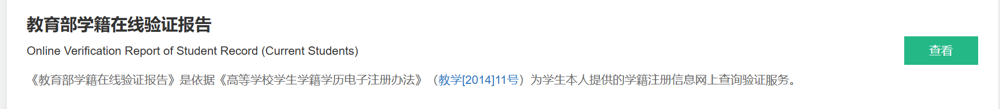
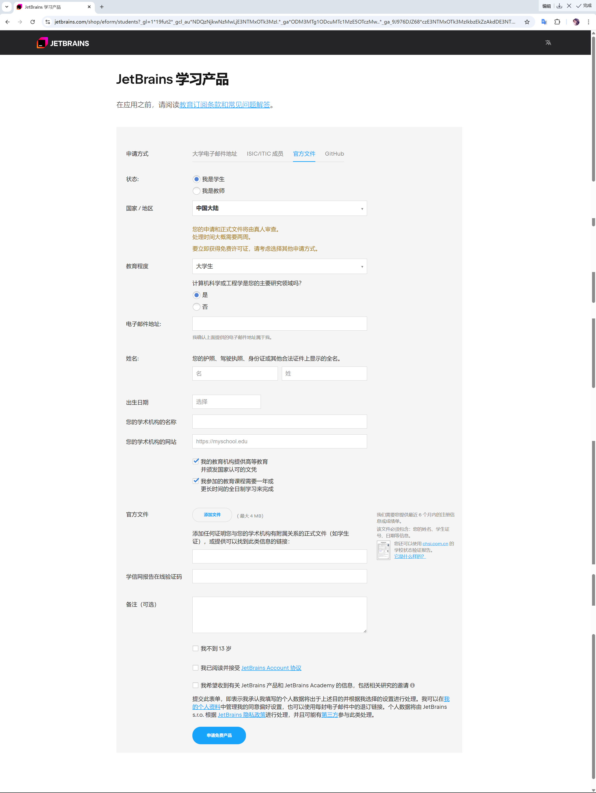

# Jetbrains学生许可证申请流程

**点击以上徽标即可跳转至网页**

## 申请在线验证报告

登录学信网之后点击在线验证报告，未申请的同学需要先申请报告，已申请的同学需要确保报告在有有效期内，如果已过期需要延长有效期

申请好之后复制在线验证码，点击查看，再点击保存

## 申请学生许可证

按照要求填写信息即可，学术机构的名称填写北京印刷学院，学术机构网站填https://www.bigc.edu.cn/

官方文件选择下载好的学信网在线验证报告文件，在线验证码粘贴即可

