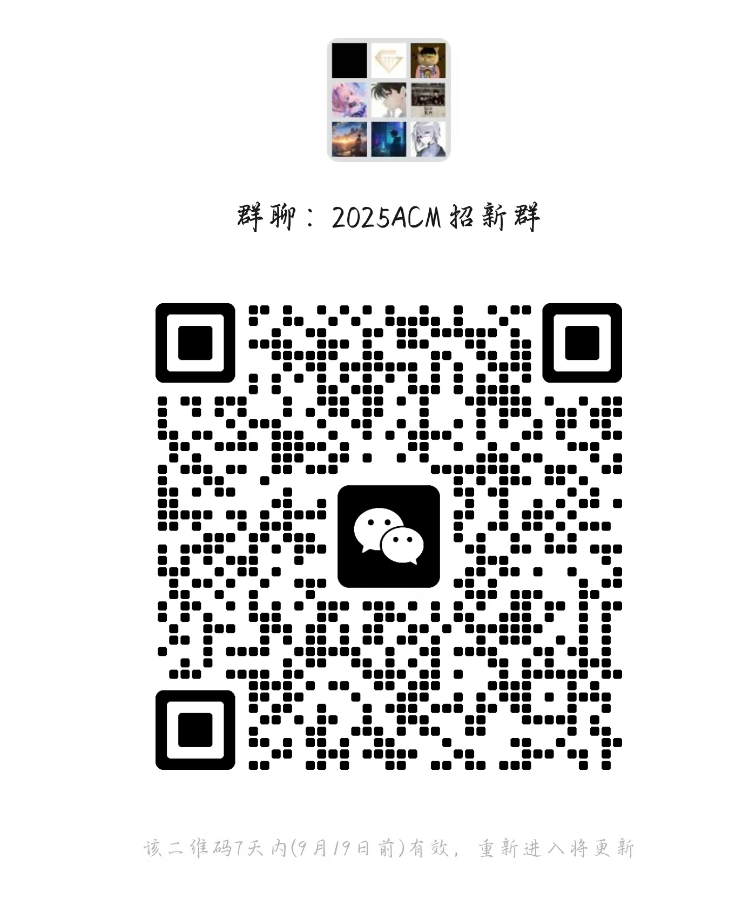

<!-- ## 北京印刷学院 ACM-ICPC 集训队官方网站 -->

北京印刷学院 ACM-ICPC 集训队是从属于北京印刷学院信息工程学院的创新团队，在近三年的历史中代表北京印刷学院多次出征程序设计竞赛（[国际大学生程序设计竞赛(ICPC)](https://icpc.global/)、[中国大学生程序设计竞赛(CCPC)](https://ccpc.io/)、[蓝桥杯全国软件和信息技术专业人才大赛](https://dasai.lanqiao.cn/)、[团体程序设计天梯赛(CCCC-GPLT)](https://gplt.patest.cn/regulation)），并围绕于此组织选手的选拔、训练、培养以及科普等活动。

集训队近年来战绩：

- 待补充 @modcx

更多历年成绩请参见：暂无

🌐 官方网站：<https://bigcacm.pages.dev/>

🏙️ 官方 GitHub 账号：[@bigcicpc](https://github.com/bigcicpc)

📧 联系邮箱：[LeNotFound@outlook.com](mailto:LeNotFound@outlook.com)

🤝 BIGCACM 2025 招新群（萌新群）：  

### CONTRIBUTING

如果你有任何的建议、提案，抑或者你是 BIGCACM 集训队一员，并且希望在你的 GitHub 账号上添加 BIGCACM 组织标识，请参见 [CONTRIBUTING.md](CONTRIBUTING.md) 指引进行贡献，**一旦你的 PR 被允许合并**，我们将会邀请您成为我们组织的成员。

我们希望这个组织能够继续发展壮大，并且有人能够持续维护该组织的项目，我们非常需要你的支持。继任队长若有需要域名、邮箱、GitHub 公号等服务，请联系现任维护者：[LeNotFound@outlook.com](mailto:LeNotFound@outlook.com)