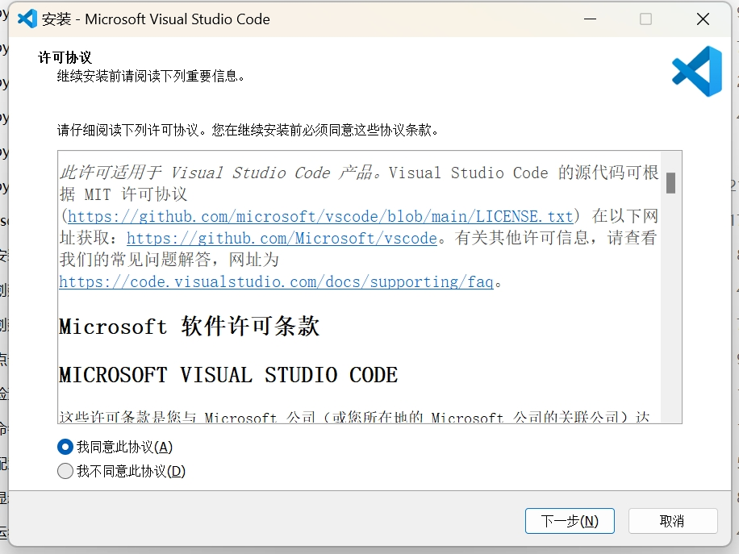
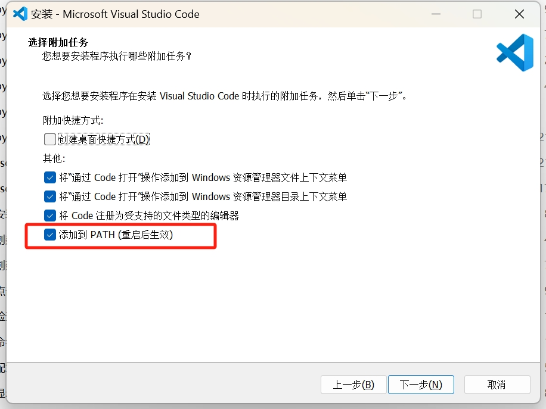

# C/C++ 环境配置

## vscode + mingw-w64

### 下载并安装 [vscode](https://code.visualstudio.com/Download)

1. 下载

    通常选择 System Installer 版本，根据电脑处理器选择 64-bit 或 32-bit。

    若是近几年购买的电脑，基本上都是 64-bit。

    

2. 安装

    同意协议

    

    这里其他选项随意，按自己需求来就好，但一定要勾选将 vscode 添加到 PATH。

    

    预览要做的事情之后安装即可

    

### 初步配置

下载并安装好后，在这里安装对应需要的插件。


搜索并安装如下插件：
- [Chinese (Simplified) (简体中文) Language Pack for Visual Studio Code](https://marketplace.visualstudio.com/items?itemName=MS-CEINTL.vscode-language-pack-zh-hans)
- [C/C++](https://marketplace.visualstudio.com/items?itemName=ms-vscode.cpptools)

更换语言后需重启 vscode。

### 下载并配置 mingw-w64

1. 下载

    从 [niXman/mingw-builds-binaries](https://github.com/niXman/mingw-builds-binaries/releases) 中选择

    推荐下载含 `x86_64` `release` `posix` `seh` `ucrt` 的版本。

    解压并放置在无中文无空格的固定路径下，例如 `D:\mingw64`。

2. 配置环境变量

    复制路径 `D:\mingw64\bin`。**根据自己的解压路径进行修改**。

    

    

    

    

    

    

3. 验证是否成功

    打开命令行窗口（++win+r++，输入 `cmd`，回车），输入 `g++ -v`，如果显示版本信息则说明配置成功。

    

### 配置 vscode 以使用 mingw-w64

1. 创建自己的工作区文件夹

    例如 `D:\vscode_workspace`。

    同样推荐无中文无空格，以减少不必要的麻烦。

2. 在 vscode 中打开该文件夹

    打开 vscode，选择 `文件 -> 打开文件夹...`，选择刚刚创建的工作区文件夹。

    

3. 配置 C++ 插件

    在打开的工作区中，按 ++ctrl+shift+p++，输入 `C/C++: 编辑配置 (UI)` 并选择它。

    

    在弹出的界面中，选择 `Compiler path` 右侧的文件夹图标，选择 `D:\mingw64\bin\g++.exe`。**根据自己的解压路径进行修改**。

    

    `IntelliSense mode` 选择 `gcc-x64`。

    

    `C++ 标准` 选择 `c++20`。

    

    配置完成后关闭该界面。

    注意到左侧文件树中多了一个 `.vscode` 文件夹，里面有一个 `c_cpp_properties.json` 文件，这个文件保存了刚刚的配置。

    同时，`.vscode` 文件夹管理着该工作区的所有配置。

4. 配置任务以编译代码

    在左侧文件树新建一个 `1.cpp` 文件。
    
    
    
    输入以下代码：

    ```cpp
    #include <iostream>
    using namespace std;
    int main()
    {
        cout << "Hello, World!" << endl;
        return 0;
    }
    ```

    然后按 ++f5++，选择 C++（GDB/LLDB） 进行调试。

    

    选择 g++ 构建和调试活动文件

    

    这时会自动编译运行，在终端中可以看到结果，如正确输出 `Hello, World!` 则说明配置成功。

    

    此后便可以正常使用 ++ctrl+shift+b++ 对当前打开的 cpp 文件进行编译。

5. 配置调试

    左侧选择 `创建 launch.json 文件`。

    

    选择 C++ (GDB/LLDB)

    

    点击右下角的 `添加配置...`，选择 `C/C++: (gdb) 启动`。

    

    然后在左侧文件树找到 `.vscode/tasks.json`，按住 ++ctrl++ 双击打开。

    

    把 `tasks.json` 中第 12 行的文件路径/文件名复制到 `launch.json` 中的 `program` 字段中。

    

    把 `tasks.json` 中第 6 行的路径复制到 `launch.json` 中的 `miDebuggerPath` 字段中，并把后缀改成 `gdb.exe`。

    

    在 `launch.json` 末尾添加 `preLaunchTask` 字段，值为 `tasks.json` 中的 `label` 字段的值 `C/C++: g++.exe 生成活动文件`，这一步的目的是为了在调试前先编译代码，确保调试的是最新的代码。

    

    回到 `1.cpp`，在 `cout` 语句处按 ++f9++ 打个断点，然后按 ++f5++ 进行调试。

    

    会发现程序在断点处停下来了，可以查看变量的值等，也可以按 ++f5++ 继续运行程序。

    

此后便可以正常使用 ++f5++ 进行调试，按 ++ctrl+f5++ 进行不调试的运行。

至此，vscode + mingw-w64 的 C++ 环境配置完成。