# 一、软件讲解

## 1.1基本技能

如果你没有什么玩电脑的经验，一定要好好看下1.1，先熟悉电脑

不要背，过一眼，平时多操作

```
- ctrl + c 复制
- ctrl + v 粘贴
- ctrl + x 剪切 （删除原来内容）
- ctrl + z 撤销  （恢复之前的状态，解决误删，误增）
- ctrl + a 全选
- ctrl + f 查找
- alt+ f4 关闭当前窗口
- ctrl + s 保存 （养成习惯）
- alt(按住) + tab 切换窗口
```

### 1.1.2 截图

```
QQ截图（聊天窗口会有一个剪刀，鼠标放上去有快捷键alt+Ctrl+a，但是要在登录QQ的情况下使用）
系统自带 win键+shift+s
聊天工具一般都有，可以自行查看快捷键
```

要通过「资源管理器」隐藏或显示文件后缀，请按照以下步骤操作：

1、使用`Windows + E`快捷键打开「文件资源管理器」。

2、点击顶部的「查看」>「显示」，勾选和取消勾选「文件扩展名」选项，可以显示和隐藏文件后缀。

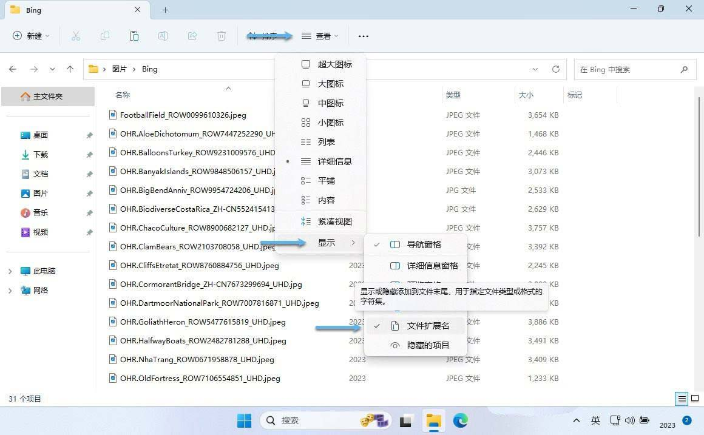

一些常见的文件扩展名

```

mp4 视频文件
mp3 音频文件
txt 记事本文件
apk 安卓安装包文件
docxpptx zip 压缩包
png jpg 图片
py python文件c c文件
```

### 1.1.3 路径(文件位置)

路径表示法

 电脑上：文件和文件夹都有路径 

 windows的路径 从磁盘出发 通过 \ 来表示下一级 

 cmd中可以通过where python 查看python解释器文件的路径 

### 1.1.4CMD命令行

电脑存在两种管理文件的方式

```
图形化界面，正常的鼠标点点点
命令行界面，纯命令控制电脑。不需要鼠标
```

cmd命令行是widows系统中的命令行工具，允许用户用过输入文本命令与操作系统交互。对于电脑小白，掌握一些常用的cmd命令是非常有用的， 尤其是在处理文件、检查系统状态等任务时。

1.打开cmd命令行

- 方法 1：按下 `Win + R`，输入 `cmd`，然后按回车。

- 方法 2：在开始菜单中搜索 `cmd`，然后点击打开。

- 方法 3：在文件夹中的上方地址入口直接输入cmd

2、路径结构解释 

```
C:\Users\12312
表示windows系统所在的磁盘分区（通常是c:驱动器），表示磁盘下的路径，表示当前正在c盘下的Users文件夹下的12312文件夹

```

3.基础命令

```
可以在cmd输入指令做一些python相关操作，比如 查看Python位置、启动Python、为python安装第三方库、检查Python版本等...

where pyton  查看当前python在电脑位置
python		 进入python交互式模式
python xx.py  执行Python文件
python --version 查看当前python的版本
...
```

## 1.2 Python概念

Python是一门计算机**编程语言**

2024年6月最新的TIOBE编程语言排行榜

### 1.2.1 何为编程语言

编程：编写程序 ，程序就是一种指令（计算机发明出来是为了给人类工作，计算机毕竟是电子硬件的集合，一种专门与计算机对话的指令（代码Code））

编程语言是开发者用来与计算机沟通的一种工具，它是一种特定的语法和规则，用于编写能够被计算机执行的指令。通过编程语言，开发者可以开发软件、网站、应用程序，甚至控制硬件设备。

简单来说：

- **编程语言**是人与计算机之间的“翻译器”，它把人类能够理解的逻辑和算法转换为计算机可以执行的机器指令。

**编程语言的分类**

- **低级语言**： 

- 指的是计算机能直接理解的语言 ，直接与硬件打交道，性能高，但复杂度较高。

- 示例：

  - **机器语言**：由二进制代码（0 和 1）组成。

    - 10101001  二进制代码是能被直接执行理解的语言 

    - 为什么电子硬件采用二进制？

      - ```
        电子器件：通电、断电
        单纯的2种逻辑很适合抽象为0和1
        计算机使用二进制的主要原因包括技术实现简单、运算规则简化、适合逻辑运算、易于转换以及抗干扰能力强等
        ```

**高级语言**：

- 更接近人类自然语言（英语，指令语法）， 具有更高抽象层次的编程语言，开发效率高。但这类语言最终也需要通过编译器或者解释器转化翻译为计算机能够理解的低级语言

- 示例：

  - 编译型： C、C++、Go、Java 

    - 特点： 先全部翻译，再执行
      -   在程序运行前，需要通过编译器将整个源代码一次性转换为机器代码，生成可执行文件。
      -    运行时，直接执行这个可执行文件，无需再次进行编译。
    - 优点： 运行速度快
    - 缺点：开发速度慢 

  - 解释型： Python、JavaScript、PHP 

    - 特点：翻译一句，执行一句
      - 在程序运行时，逐行解释执行源代码，即将源代码逐行转换为机器代码并立即执行。
    
      - 不会生成可执行文件，而是依赖解释器来执行转换后的中间代码。
    
    - 优点：开发速度快 
    
    - 缺点：运行速度比编译型慢


### 1.2.2 Python介绍

Python是高级编程语言中的解释型语言。解释型语言 ，Python翻译成英文是 蟒蛇

Python相对于别的语言优缺点优点

- 优点
  - 简单易学
  - 明确优雅（很适合AI)
  - 开发速度快
- 缺点
  - 运行速度与编译型语言相比较慢 

Python有两种运行模式

1. 交互式模式

   ```python
   在命令行或终端中直接输入代码并立即执行。
   非常适合用来进行 简单的代码测试 或 调试小片段代码。
   
   少用，只适合简单测试使用
   ```

   - 使用方式
     1. 打开cmd命令行
     2. 输入python
     3. 进入交互式环境（提示符为 >>> ) ，直接开始写代码，回车执行一行

2. 文件模式(主流)

   ```python
   通过编写 xxx.py 文件，可以直接将整个文件的代码一次性执行
   适合 开发完整程序 或 复杂项目。
   代码可以保存、重复运行，便于管理和维护。
   ```

   - 使用方式

     1. 在文本编辑器中(记事本、Pycharm、VSCODE)中编写代码

     2. 保存文件，例如 hello.py

     3. 命令行中使用以下命令运行文件

        python hello.py

python环境搭建

运行环境：python

开发环境：pycharm

# 二、安装python

## 方法一：官网安装

### 1、找到官方网站

官网网址:[Welcome to Python.org](https://www.python.org/)

在搜索引擎中搜索 python 关键字，带有 “官网” logo 的结果即为 Python 官方网站（注意不要点到带有 “广告字样” 的结果）。

### 2、找到下载页面

选择 "Download for Windows"：

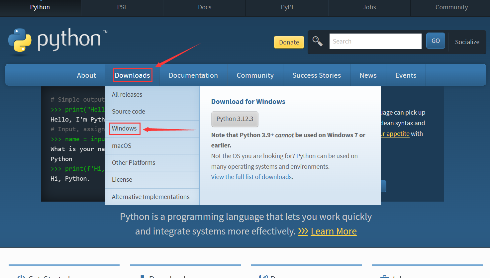

下载完成后，会得到一个 exe 的安装程序。

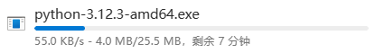

### 3、双击安装包

双击安装包，安装 Python。

**注意**：最好勾选下 "Add python.exe to PATH" 这个选项。要记得 Python 的安装目录（后面可能会用到）。

点击 Install Now 之后稍等片刻，就安装完毕了。

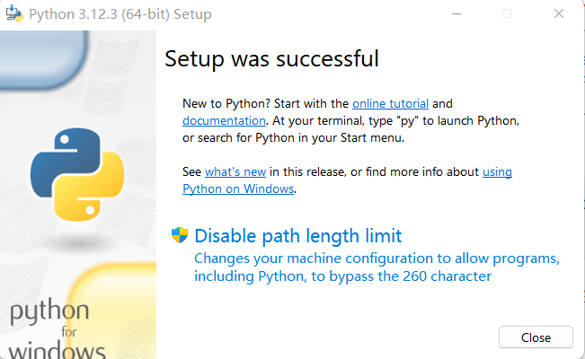

### 4、运行 hello world

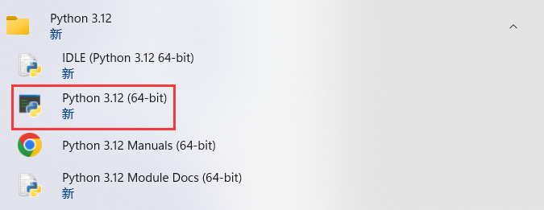

其中最关键的就是这个 python.exe，后续运行 Python 程序，全靠这个 python.exe。

如果直接双击这个 python.exe，就会打开 Python 的交互式解释器（控制台程序）。在这个交互式解释器中，就可以输入 Python 代码了。直接输入 print('hello') 这句代码，按下 enter 键，则打印出了 hello 这样的结果。


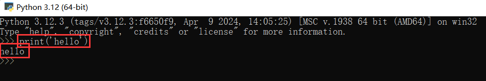

## 方法二： 国内镜像站 安装

在国内安装 Python 时，由于网络原因，直接从官网下载可能速度较慢。以下是使用国内镜像站安装 Python 的详细教程 

### 1.找到国内 Python 镜像站

推荐几个稳定的国内 Python 镜像站：

- 清华大学开源软件镜像站：https://mirrors.tuna.tsinghua.edu.cn/python/

- 阿里云开源镜像站：https://mirrors.aliyun.com/python/

- 中国科学技术大学镜像站：https://mirrors.ustc.edu.cn/python/

  ### 2.选择镜像站下载安装包

  打开上述任意镜像站，进入 `python` 目录，根据需要选择版本（推荐 3.8 及以上版本）：

  - 进入对应版本文件夹（如 `3.11.4/`）
  - 下载适合 Windows 的安装包：
    - 64 位系统：选择 `python-3.11.4-amd64.exe`
    - 32 位系统：选择 `python-3.11.4.exe`

  ### 3. **运行安装程序** 

  （以下步骤与方法一类似，可参考方法一的“3、双击安装包”）
  
  双击下载的 `.exe` 文件，勾选 **"Add Python 3.x to PATH"**（重要，自动配置环境变量），然后点击 **"Install Now"** 进行默认安装，或选择 **"Customize installation"** 自定义安装路径。

## 三、安装 PyCharm

虽然通过交互式解释器可以执行 Python 代码了，但是代码写起来并不方便，那么就需要更专业的开发工具来编写 Python 代码。

### ***1、找到官方网站***

JetBrains 是捷克的一家互联网公司，主要的业务就是开发编程工具，像 Java 的 IDEA，C++ 的 CLion，Python 的 PyCharm，Go 的 GoLand 等等都是出于 JetBrains 之手。这些工具功能都非常强大，深受广大程序员的喜爱，因此网友们也亲切的称呼这些开发工具为 “JB 全家桶”。


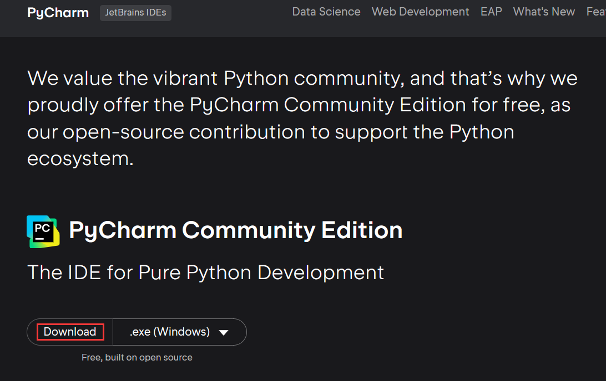

### 3、双击安装包

双击安装包，选择 “下一步”

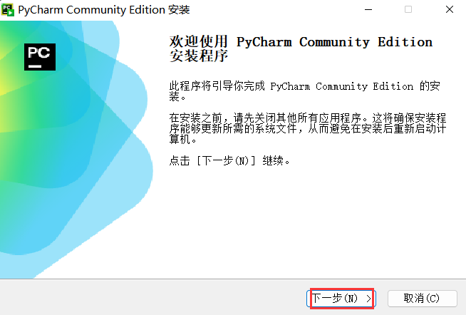

注意选择安装路径：

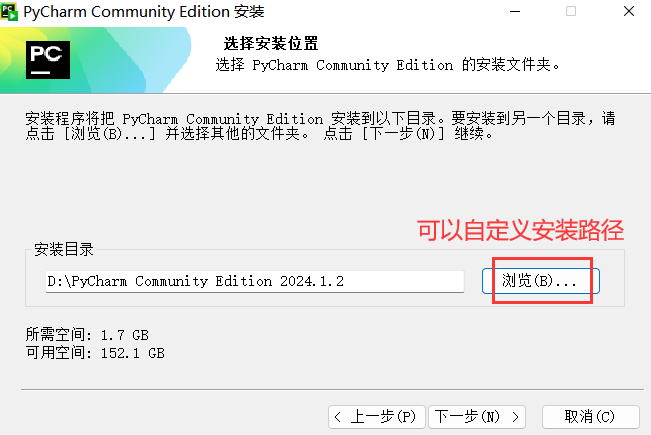

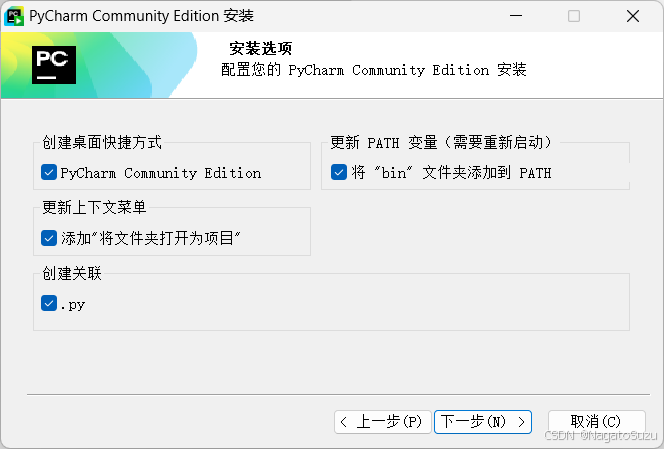

选择 "JetBrains "，直接安装即可，这个安装过程非常简单，一般只要不报错，就算安装成功。

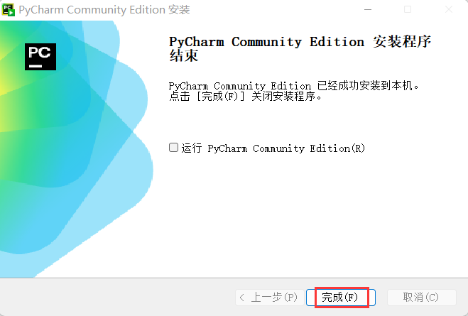

#### （1）创建一个项目

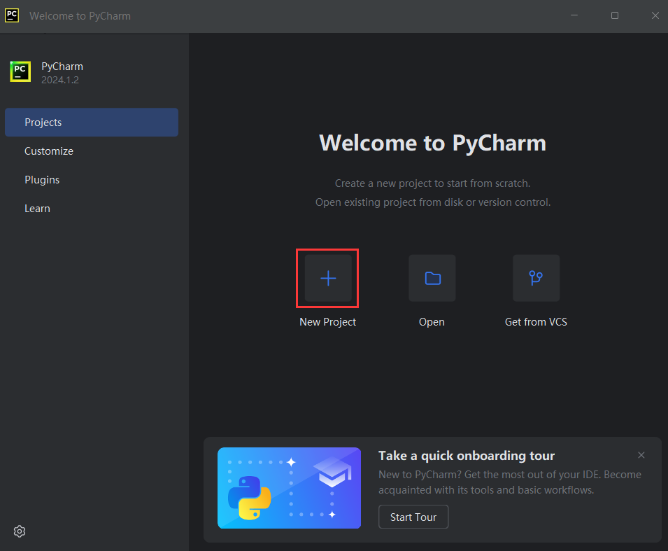

#### （2）选择项目所在的位置，并选择使用的 Python 解释器（就是刚才下载的exe文件）

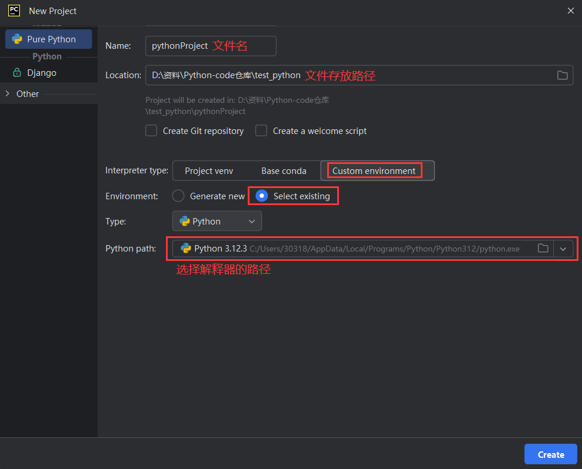


#### （3）创建文件

右键左侧的项目目录，选择 New -> Python File

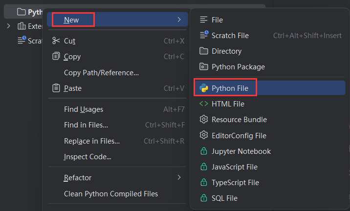

接着填写文件名：

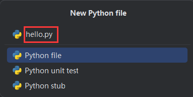

#### （4）编写代码

#### （5）运行程序

右键文件，选择 "Run 'hello' "

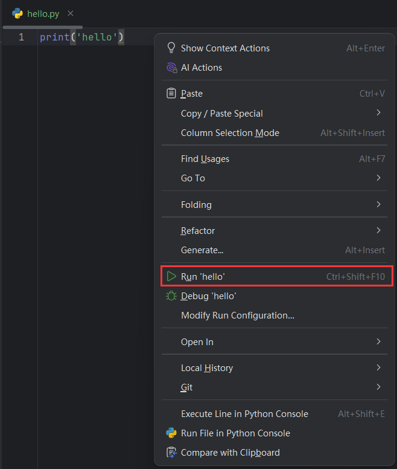

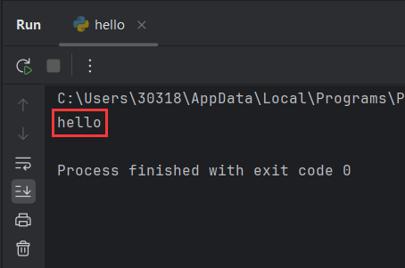


PS：可以下载中文插件，但不推荐，尝试习惯英文界面是有好处的